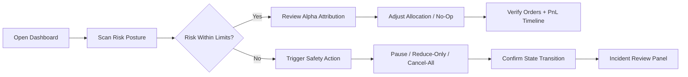
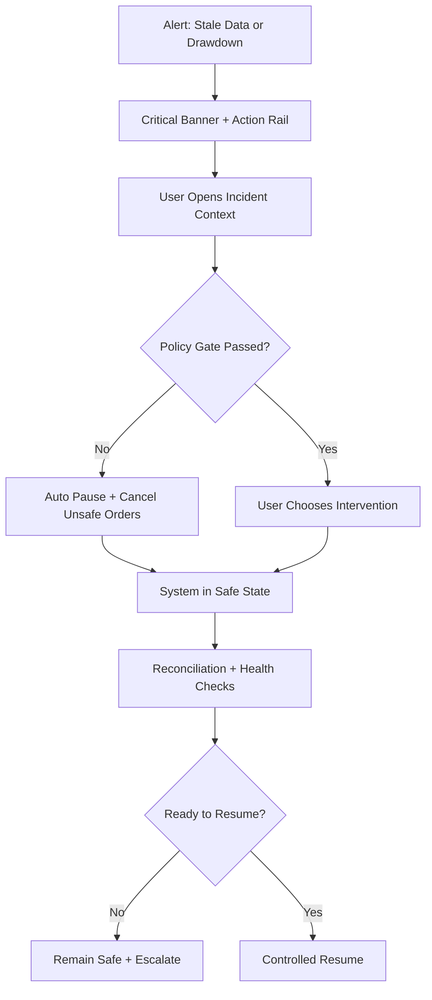
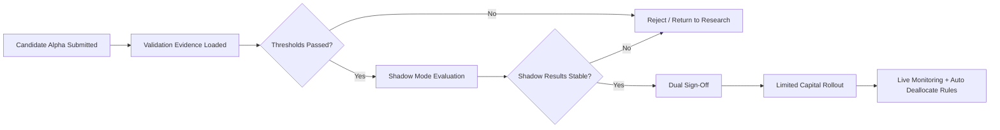

# UX Design Specification - polymarket-ai

**Author:** Sang  
**Date:** 2026-04-04  
**Theme direction:** Claude.com + Claude Blog inspired (editorial warmth + product clarity)

## Executive Summary

### Project Vision

Build a calm, trustworthy, high-signal control room for Polymarket trading operations where users can:
- understand risk posture in seconds,
- make high-impact decisions confidently,
- and always recover safely when market conditions degrade.

The UX should feel like a premium research/editorial product at first glance, then reveal an operator-grade decision system underneath.

### Target Users

1. **Primary operator (Sang / quant operator)**  
   Needs instant portfolio clarity, reliable execution controls, and strong auditability.

2. **Research lead / model governor**  
   Needs visibility into alpha lifecycle, validation evidence, and promotion/rollback readiness.

3. **Support & reliability analyst**  
   Needs forensic workflow support: signal → order → fill → PnL → incident cause.

### Key Design Challenges

- **Information overload:** simultaneous risk, execution, and strategy signals.
- **Trust under volatility:** users must believe the state shown is current and reliable.
- **Safety-critical interaction design:** pause, reduce-only, cancel-all must be fast and unambiguous.
- **Mixed cognitive modes:** overview scanning, deep diagnosis, and emergency action in one interface.

### Design Opportunities

- Turn risk operations into a **narrative timeline** users can reason about quickly.
- Use warm editorial design cues to reduce anxiety while preserving technical precision.
- Create a distinct UX edge through **clarity + governance explainability**, not visual novelty alone.

## Core User Experience

### Defining Experience

**"See, decide, act, verify" in under 30 seconds.**

The core product promise is a short, repeatable operator loop:
1. **See** current portfolio/risk truth,
2. **Decide** whether to hold, throttle, or intervene,
3. **Act** via explicit, safe controls,
4. **Verify** impact with traceable evidence.

### Platform Strategy

- **Primary:** desktop web app (operator workstation).
- **Secondary:** tablet-adapted responsive mode for incident checks.
- **Mobile:** limited controls, read-heavy monitoring, no destructive actions by default.

### Effortless Interactions

- One persistent command rail for high-impact actions.
- Single-query incident search (market/order/alpha/time) with immediate timeline output.
- Default summaries that answer: *What changed? Why? What should I do?*

### Critical Success Moments

- First login: user can identify current risk posture within 5 seconds.
- Incident event: user can pause trading and confirm system state transition within 5 seconds.
- End-of-session review: user can explain PnL movement with evidence in < 60 seconds.

### Experience Principles

1. **Calm before clever** — clarity beats novelty in every critical state.
2. **Truth over decoration** — every visual layer must map to an actionable signal.
3. **Safety is visible** — risky states and controls are explicit and irreversible by accident.
4. **Context without clutter** — deep detail is one interaction away, not always-on.
5. **Audit by design** — every meaningful action is explainable and reconstructable.

## Desired Emotional Response

### Primary Emotional Goals

- **Calm confidence:** “I understand the system and can control it.”
- **Operational trust:** “The platform tells me the truth, even in stress.”
- **Professional momentum:** “I can move from insight to action quickly.”

### Emotional Journey Mapping

- **Entry:** grounded, oriented, not overwhelmed.
- **Core operation:** focused, deliberate, in control.
- **Disruption/incident:** alert but not panicked.
- **Post-action verification:** reassured and accountable.

### Micro-Emotions

- Confidence > confusion during decision points.
- Assurance > anxiety during system warnings.
- Completion > ambiguity after intervention.
- Pride > uncertainty during daily/weekly review.

### Design Implications

- Confidence is supported by consistent hierarchy + explicit state labels.
- Trust is supported by timestamps, provenance, and reconciliation indicators.
- Calm is supported by warm neutrals, restrained accents, and generous spacing.
- Urgency is reserved for true risk states (not general emphasis).

### Emotional Design Principles

- Use warmth for baseline context, contrast for risk events.
- Prefer explanatory labels over terse technical shorthand.
- Pair every warning with one clear recommended next action.

## UX Pattern Analysis & Inspiration

### Inspiring Products Analysis

**Primary reference: Claude.com / Claude Blog**
- Strong typographic hierarchy with editorial readability.
- Warm, neutral background foundation with selective accenting.
- Spacious layout rhythm and deliberate content grouping.
- Reusable card modules with clear metadata and CTA zones.

### Transferable UX Patterns

- **Editorial hero + operational body:** calm intro surface, dense utility beneath.
- **Metadata-first cards:** timestamp, category, status before detail.
- **Soft surface hierarchy:** layered neutrals instead of high-contrast grid noise.
- **Pill/chip categorization:** compact state and context signaling.

### Anti-Patterns to Avoid

- Neon-heavy trading UI that elevates stress baseline.
- Over-dense tables with weak visual hierarchy.
- Warning overuse that causes alert fatigue.
- Hidden destructive controls requiring multi-context navigation.

### Design Inspiration Strategy

- **Adopt:** warm palette, editorial type hierarchy, modular cards, breathing room.
- **Adapt:** convert blog-card patterns into market/alpha/risk modules.
- **Avoid:** visual mimicry or branding overlap; maintain unique product identity.

## Design System Foundation

### 1.1 Design System Choice

**Choice:** Themeable token-first system with reusable primitives.

Approach:
- CSS custom properties for semantic tokens,
- component primitives for cards, tables, controls, timeline,
- strict state tokens for risk/action semantics.

### Rationale for Selection

- Supports Claude-inspired visual language without hard-locking framework decisions.
- Enables high consistency across dashboard, reporting, and incident workflows.
- Reduces implementation and maintenance risk for a small team.

### Implementation Approach

- Define foundation tokens first (color/type/spacing/motion).
- Build primitives before feature-specific components.
- Enforce semantic token usage (no direct hex in feature components).

### Customization Strategy

- Brand layer: typography and neutral palette.
- Domain layer: trading/risk semantic states.
- Product layer: workflow-specific component variants.

## Defining Core Experience Mechanics

### 2.1 Defining Experience

**Defining interaction:** “Risk-aware intervention from live context.”

Users should be able to transition from signal detection to protective action with minimal friction and zero ambiguity.

### 2.2 User Mental Model

Users think in this order:
1. “Am I safe right now?”
2. “What changed?”
3. “What caused it?”
4. “What is the safest next action?”

The UI should mirror this ordering in both navigation and panel priority.

### 2.3 Success Criteria

- User identifies current risk state in ≤ 5 seconds.
- User executes safety action in ≤ 2 interactions.
- User confirms outcome with timestamped evidence in ≤ 10 seconds.

### 2.4 Novel UX Patterns

- **Signal-to-action strip:** always-visible action panel aligned to current risk state.
- **Causal timeline:** linked events from model signal through execution and PnL impact.
- **Governance badges:** promotion readiness and validation health inline with strategy cards.

### 2.5 Experience Mechanics

1. **Initiation:** system highlights material state changes automatically.
2. **Interaction:** user inspects summary + root cause drilldown.
3. **Action:** user triggers policy-safe controls from contextual rail.
4. **Feedback:** state confirmation + audit record appears immediately.
5. **Completion:** user gets “system stable / escalation required” clarity.

## Visual Design Foundation

### Color System

| Token | Purpose | Value |
|---|---|---|
| `--bg-canvas` | App background | `#F6F2EA` |
| `--bg-surface` | Card/sheet | `#FFFDF9` |
| `--bg-elevated` | Elevated panels | `#FFFFFF` |
| `--text-primary` | Main text | `#1F1D1A` |
| `--text-muted` | Secondary text | `#6D675E` |
| `--border-soft` | Soft borders | `#E7E0D3` |
| `--accent-primary` | Primary action | `#C96A3D` |
| `--accent-secondary` | Secondary highlight | `#8C5A3C` |
| `--state-success` | Positive state | `#1F7A4C` |
| `--state-warning` | Caution state | `#B16B00` |
| `--state-danger` | Critical risk | `#B2352F` |
| `--state-info` | Informational | `#2F5D9A` |

### Typography System

- **Display/Headings:** `Source Serif 4`, serif, strong editorial tone.
- **UI/Body:** `IBM Plex Sans`, sans-serif, highly legible at dense sizes.
- **Monospace/Data:** `IBM Plex Mono` for IDs, order refs, and metric snippets.

Type scale:
- H1: 48/56
- H2: 36/44
- H3: 28/36
- H4: 22/30
- Body L: 18/28
- Body M: 16/24
- Body S: 14/20
- Caption: 12/16

### Spacing & Layout Foundation

- Base unit: **8px**.
- Radius system: 8 / 12 / 16 / 24.
- Max content width for analysis pages: 1280px.
- Dashboard grid: 12 columns desktop, 8 tablet, 4 mobile.

### Accessibility Considerations

- WCAG 2.2 AA baseline.
- Text contrast ≥ 4.5:1 (body), ≥ 3:1 (large text).
- Focus rings always visible and color-independent.
- Destructive actions require clear labeling + keyboard-safe confirmation flow.

## Design Direction Decision

### Design Directions Explored

1. **Warm Precision** (selected)
2. Quiet Terminal
3. Editorial Ledger
4. Dense Analyst
5. Minimal Mission Control
6. Contrast-First Risk Desk

### Chosen Direction

**Warm Precision** — editorial calm + operational sharpness.

Key traits:
- warm neutral canvas,
- sharp data modules,
- restrained accenting,
- explicit risk color semantics,
- minimal but meaningful motion.

### Design Rationale

- Best balances stress reduction and high-stakes decision clarity.
- Aligns with Claude.com aesthetic influence while remaining domain-specific.
- Supports both deep analysis and rapid intervention workflows.

### Implementation Approach

- Build dashboard shell + token system first.
- Implement high-risk workflows (pause/reduce-only/cancel-all) as interaction gold paths.
- Expand into research/governance views using same component language.

## User Journey Flows

### Journey 1 — Daily Operator Control Loop

### Journey 2 — Incident Safe-State Workflow

### Journey 3 — Alpha Promotion Governance

### Journey Patterns

- Trigger → Context → Action → Verification is universal.
- Every critical action has pre-flight status + post-action evidence.
- Safety transitions are explicit and recoverable.

### Flow Optimization Principles

- Keep urgent flows under two interactions.
- Show only decision-relevant context by default.
- Preserve one-click path to detailed forensic evidence.

## Component Strategy

### Design System Components

Foundation components:
- App shell, top navigation, side rail
- Card, panel, divider, section headers
- Button hierarchy, chips, badges, tabs
- Data table, pagination, sort/filter controls
- Inline alert, toast, modal, drawer

### Custom Components

#### Risk Posture Banner

- **Purpose:** immediate safety visibility.
- **States:** normal, warning, critical, locked-safe.
- **Accessibility:** role=`status`, aria-live for critical transitions.

#### Action Rail (Safety Controls)

- **Purpose:** persistent high-impact controls.
- **Actions:** pause, reduce-only, cancel-all, resume.
- **States:** enabled, gated, in-progress, completed.

#### Causal Timeline Panel

- **Purpose:** map signal → order → fill → PnL.
- **Content:** timestamped events, source tags, links to artifacts.
- **States:** filtered, expanded, incident-focused.

#### Alpha Governance Card

- **Purpose:** show model readiness and lifecycle state.
- **Signals:** validation completeness, shadow result confidence, live guardrail status.
- **States:** draft, shadow, candidate-live, production, deallocated.

### Component Implementation Strategy

- Build custom components from shared tokens and primitives.
- Standardize state machine patterns (loading/empty/error/critical).
- Enforce keyboard and screen-reader parity for all action-bearing elements.

### Implementation Roadmap

- **Phase 1:** Risk banner, action rail, core tables, incident timeline.
- **Phase 2:** Governance cards, promotion workflows, report surfaces.
- **Phase 3:** Advanced drilldowns, comparative strategy overlays, scenario tools.

## UX Consistency Patterns

### Button Hierarchy

- **Primary:** major workflow continuation (single per zone).
- **Secondary:** non-destructive alternatives.
- **Tertiary/Text:** lightweight actions.
- **Danger:** destructive controls with confirmation contract.

### Feedback Patterns

- Success: concise, actionable confirmation.
- Warning: condition + recommendation.
- Error: failure + recovery path.
- Critical: blocking banner + required action.

### Form Patterns

- Progressive disclosure for advanced strategy parameters.
- Validation on blur + summary on submit.
- Inline help for risk-impacting fields.

### Navigation Patterns

- Left rail: primary product areas.
- Top bar: context switching + global status.
- In-page tabs: scoped workflow sub-views.

### Additional Patterns

- Empty states include “what to do next.”
- Loading states use skeletons, not spinners-only.
- Search results prioritize relevance + recency + severity.

## Responsive Design & Accessibility

### Responsive Strategy

- Desktop-first optimization for operator workflows.
- Tablet mode preserves key controls with reduced panel density.
- Mobile mode is monitor-first, action-limited by policy.

### Breakpoint Strategy

- Mobile: 320–767
- Tablet: 768–1023
- Desktop: 1024+
- Wide desktop: 1440+

### Accessibility Strategy

- WCAG 2.2 AA target across core flows.
- Full keyboard operation for every critical interaction.
- Screen-reader support for status updates and action confirmations.
- Motion-respectful mode via `prefers-reduced-motion`.

### Testing Strategy

- Manual keyboard walkthrough of top 10 user tasks.
- Automated accessibility checks in CI.
- Contrast and focus-state regression checks.
- Real-device responsive checks for critical incident workflows.

### Implementation Guidelines

- Prefer semantic HTML and explicit labels.
- Use relative typography/spacing units.
- Keep touch targets ≥ 44x44 px.
- Never encode meaning by color alone.

## Deliverables

- `/_bmad-output/planning-artifacts/ux-design-specification.md`
- `/_bmad-output/planning-artifacts/ux-color-themes.html`
- `/_bmad-output/planning-artifacts/ux-design-directions.html`

## Completion Notes

- UX workflow initialized, completed, and saved with `lastStep = 14`.
- No central workflow status registry file was found in this repository to update `workflow_status["create-ux-design"]`.
- External style reference collection completed; two category URLs (`/blog/category/agents` and `/blog/category/claude-code`) repeatedly failed to fetch due socket errors, while equivalent style structure was inferred from other successfully fetched pages.
